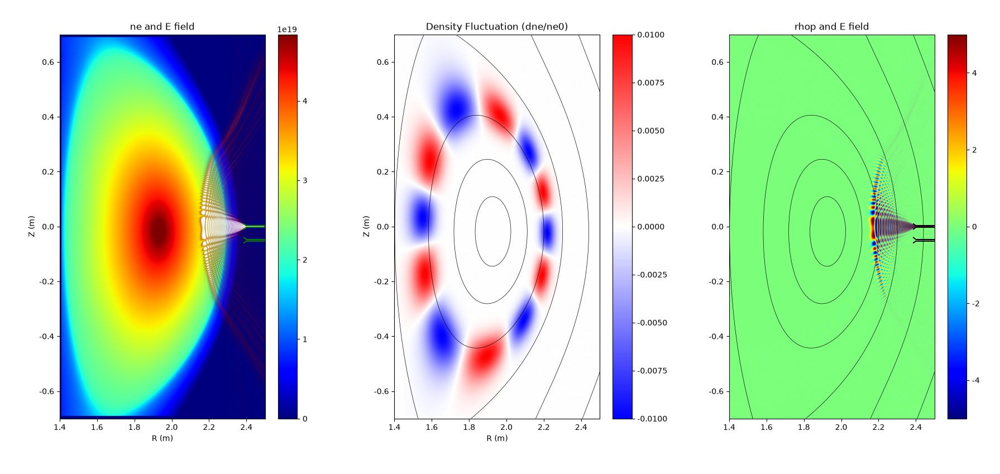

# FFW2D: A 2D Full-Wave Simulation Code Based on Finite Difference Method

基于有限差分的二维全波模拟程序
## 🚀 Features 
- Supports both O-mode and X-mode propagation. 
- Supports both CPU and GPU acceleration.
- Supports adding density fluctuations.
- Supports custom antenna configurations.



## 🛠 Build and Compilation 
### Prerequisites
Before compiling the program, please ensure that the following dependencies are installed on your system:
- CMake (>= 3.16) 
- GCC (with C++20 support) 
- kokkos (>=5.1)
### Compilation Steps 

##### 1. Clone the repository to your local machine: 
```
git clone https://github.com/aibotez/FFW2D.git
```
##### 2. Navigate into the repository and create a `build` directory: 
```
mkdir build && cd build 
```
##### 3. Generate the build configuration based on your hardware target:
```
--For CPU execution:
cmake .. -DUSE_GPU=OFF  -DKokkos_ROOT=/xx/kokkos

--For CPU + OpenMPI execution:
cmake .. -DUSE_GPU=OFF -DUSE_MPI=ON -DKokkos_ROOT=/xx/kokkos

--For GPU acceleration:
cmake .. -DUSE_GPU=ON  -DKokkos_ROOT=/xx/kokkos-GPU
```
##### 4. Compile the project:
```
cmake  --build .
```
After a successful compilation, you will find the generated executable binary file inside the `build` directory.
##### 5.Running:
Prepare your input files (such as the density profile and the `gfile`), then run the program using one of the following commands:
```
./ffw2d 
Or specify the path to your configuration file: 
./ffw2d /xx/ffw2d_input.dat
```
