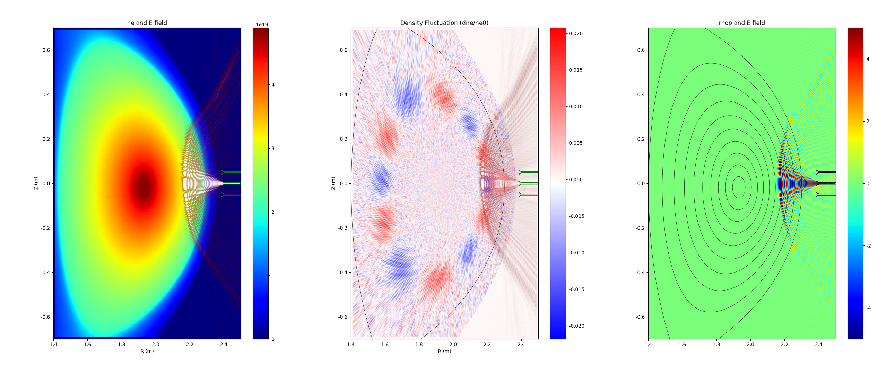

# FFW2D: 2D Finite-Difference Time-Domain Full-Wave Simulation


## 🚀 Features 
- Supports both O-mode and X-mode propagation. 
- Supports both CPU and GPU acceleration.
- Supports adding density fluctuations.
- Supports custom antenna configurations.



## 🛠 Build and Compilation 
### Prerequisites
Before compiling the program, please ensure that the following dependencies are installed on your system:
- CMake (>= 3.16) 
- GCC (with C++20 support) 
- kokkos (>=5.1)
### Compilation Steps 

##### 1. Clone the repository to your local machine: 
```
git clone https://github.com/aibotez/FFW2D.git
```
##### 2. Navigate into the repository and create a `build` directory: 
```
mkdir build && cd build 
```
##### 3. Generate the build configuration based on your hardware target:
```
--For CPU execution:
cmake .. -DUSE_GPU=OFF  -DKokkos_ROOT=/xx/kokkos

--For CPU + OpenMPI execution:
cmake .. -DUSE_GPU=OFF -DUSE_MPI=ON -DKokkos_ROOT=/xx/kokkos

--For GPU acceleration:
cmake .. -DUSE_GPU=ON  -DKokkos_ROOT=/xx/kokkos-GPU
```
##### 4. Compile the project:
```
cmake  --build .
```
After a successful compilation, you will find the generated executable binary file inside the `build` directory.
##### 5.Running:

Prepare your input files (such as the density profile and the `gfile`), then run the program using one of the following commands:
```
if CPU execution:
	export KOKKOS_NUM_THREADS=$FFW_THREADS
	# FFW_THREADS is the parallel thread number eg. 16,32,64 ...
	export OMP_PROC_BIND=spread  
	export OMP_PLACES=threads

./ffw2d 
Or specify the path to your configuration file: 
./ffw2d /xx/ffw2d_input.dat
```
##### 6.Plotting

You can copy the `plt.py` script into your simulation results directory, and run the following command to visualize the results: 
```
python plt.py
```
##### 7.Output Files Description

- **`IQ_Isig.dat` & `IQ_Qsig.dat`**: Unfiltered IQ signal components obtained from mixing the received signal with the transmitter source (acting as the LO). _Note: Low-pass filtering is required during post-processing._
- **`ne_2d_0.dat`**: Static 2D density profile.
- **`ne_2d.dat`**: 2D density profile with fluctuations added.
- **`receive_E.dat`**: Time evolution of the electric field at the receiving antenna.
- **`Edis.dat`**: 2D spatial distribution of the electric field.
- **`time.dat`**: Simulation time steps (in seconds, `s`).
- **`R.dat` & `Z.dat`**: 2D spatial coordinates (in meters, `m`).
- **`antenna_geo.dat`**: Antenna geometry data, which can be overlaid on other plots using contour lines.